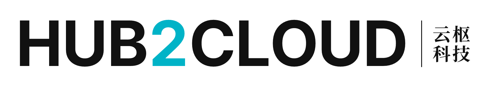
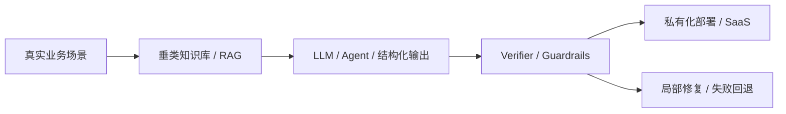

<!--
  Organization profile README for yunshu-studio
  This file is displayed on https://github.com/yunshu-studio
-->

<p align="center">
  
</p>

<div align="center">
  

  <h1>湘潭云枢科技有限责任公司</h1>

  <p>
    <strong>Yunshu Studio · Trustworthy AI Engineering</strong><br />
    做有用、可信、可交付的智能系统。
  </p>

  <p>
    <a href="mailto:1317308945@qq.com"><strong>联系我们</strong></a>
    ·
    <a href="https://github.com/yunshu-studio"><strong>GitHub Organization</strong></a>
  </p>

  <p>
    
    
    
    
    
  </p>
</div>

---

```txt
> boot yunshu-studio --mode=trustworthy-ai

[01] SCENE       Real workflows before model selection
[02] KNOWLEDGE   Domain knowledge + RAG + permission-aware data
[03] REASONING   LLM / Agent / structured output
[04] VERIFY      Evidence path / guardrails / fail-closed
[05] DELIVERY    Private deployment / SaaS / long-term operation
```

## 👋 你好，这里是云枢科技

我们是一家从真实场景出发的可信智能技术公司，关注大模型进入学校、企业、科研、招投标和政务服务流程后的可靠落地。

我们相信，AI 不应该只是“会聊天”，更应该能进入业务流程、理解专业知识、遵守权限边界、给出可靠证据，并在不确定时保持克制。

> **模型能力 + 业务知识 + 工程系统 + 可信机制**  
> 是我们构建智能系统的基本路线。

## 🧠 系统路线



## 🚀 Mission Modules

### `01` 🎓 AI 辅导员
面向高校学生服务与辅导员工作流的智能助手，覆盖学生问答、事务提醒、信息收集、风险预警、通知触达、请假与奖助等场景。  
`高校治理` `学生服务` `辅导员减负` `风险预警`

### `02` 🧪 CorrectKV / 可信推理基础设施
围绕结构化生成、KV Cache 复用、字段级验证、证据路径和局部修复，探索更稳定的大模型推理与输出控制机制。  
`KV Cache` `Structured Output` `Verifier` `Targeted Recompute`

### `03` 🛡️ AI 可信评测与安全护栏
为垂类大模型、智能体和内容生成系统提供上线前体检，关注证据一致性、权限边界、幻觉风险、越权行为与失败回退。  
`可信评测` `权限边界` `幻觉检测` `Fail-Closed`

### `04` 📄 云枢标盾 BidGuard
面向招投标场景的防废标工具，关注招标文件检测、投标材料合规自查、评标报告核验与围串标风险识别。  
`招投标合规` `防废标` `文件检测` `风险识别`

### `05` 🧩 垂类知识库与私有化部署
面向高校、科研院所、企业与政务服务场景，提供 RAG 知识库、轻量微调、权限隔离、多租户系统和私有化部署能力。  
`RAG` `LoRA` `多租户` `数据隔离`

### `06` 🏗️ 工程交付与平台化能力
从原型验证到系统上线，关注需求拆解、服务治理、权限模型、数据流转、部署运维和长期迭代，让 AI 能真正进入业务现场。  
`微服务` `SaaS` `私有化` `交付闭环`

## 🧭 Engineering Principles

- `SCENE_FIRST`：先理解真实业务，再选择技术路线。
- `EVIDENCE_FIRST`：能追溯来源，才谈得上可信。
- `BOUNDARY_FIRST`：权限、数据隔离和安全策略必须先设计。
- `DELIVERY_FIRST`：Demo 可以惊艳，系统必须稳定。
- `CONTROLLED_FAILURE`：不确定时宁可回退，也不假装正确。

## 🛠️ Tech Radar

```txt
yunshu-stack
├─ ai-core
│  ├─ LLM
│  ├─ RAG
│  ├─ Agent
│  └─ LoRA / SFT
│
├─ backend
│  ├─ Kotlin + Spring Boot
│  ├─ Python
│  ├─ Go
│  └─ Microservices
│
├─ data-infra
│  ├─ PostgreSQL / Redis
│  ├─ MinIO
│  ├─ OpenSearch / Elasticsearch
│  └─ Docker / Nacos / RabbitMQ
│
└─ trust-safety
   ├─ Permission Isolation
   ├─ Content Safety
   ├─ Structured Output
   └─ Trustworthy Evaluation
```

---

<details>
  <summary><strong>🤝 欢迎和我们聊聊</strong></summary>

  <br />

  如果你也在关注这些问题，欢迎联系：

  - 高校 AI 辅导员与学生服务智能化
  - 垂类知识库、私有化部署与智能系统集成
  - 大模型可信评测、安全护栏与输出控制
  - 招投标 AI 合规工具
  - 可信智能系统工程化落地

  📮 <strong>Email：</strong><a href="mailto:1317308945@qq.com">1317308945@qq.com</a>
</details>

---

<div align="center">
  <strong>湘潭云枢科技有限责任公司</strong><br />
  <sub>Yunshu Studio · Trustworthy AI Engineering</sub><br /><br />
  📍 湖南省湘潭市雨湖区湘潭大学创新创业孵化基地（湘潭大学学生中心）三楼303室1工位<br />
  ✉️ <a href="mailto:1317308945@qq.com">1317308945@qq.com</a>
</div>
